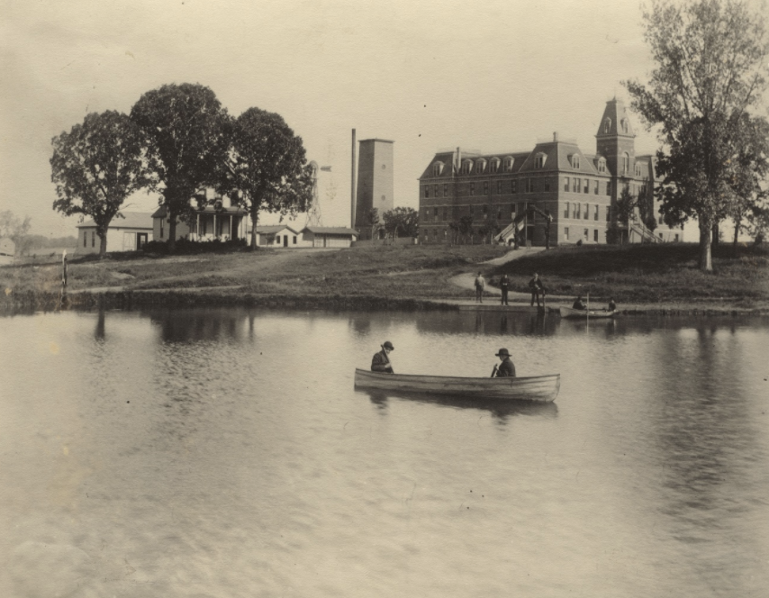
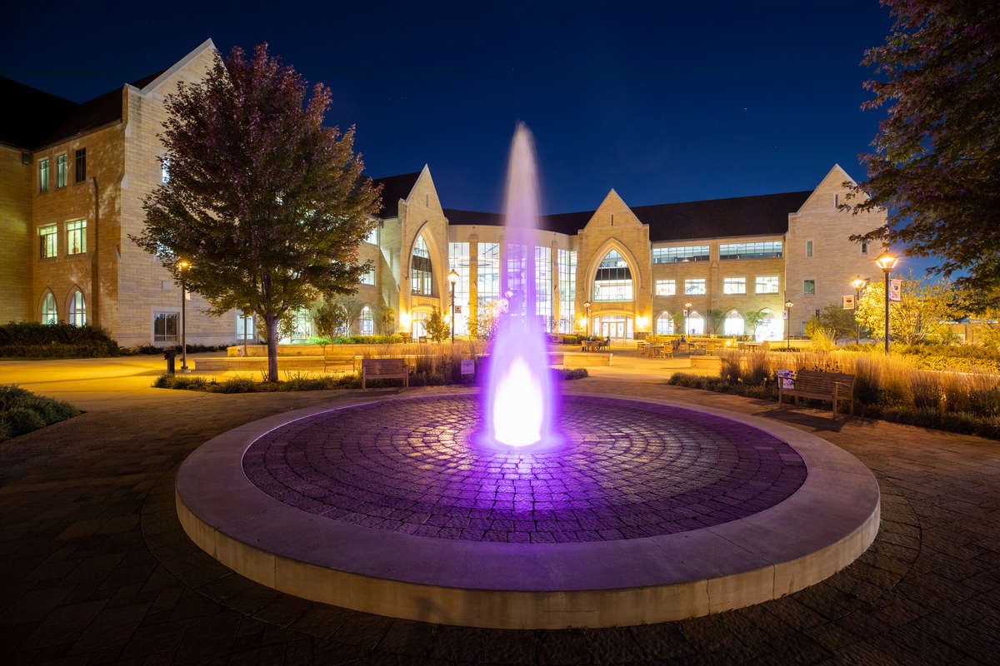

--- 
layout: page
title: "History of Water On Campus"
permalink: /history/
--- 

## The History of Water On Campus
### Lake Mennith
Over 100 years ago near the founding of the University of St. Thomas, much of what we now know as the lower quad was covered in a lake -- Lake Mennith. Lake Mennith, (Mennith now the name of the building between Dowling Hall and SJV on the upper quad), covered much of the land of what is now occupied by O’Shaughnessy-Frey Library, O’Shaughnessy Educational Center, and Murray-Herrick Campus Center. However, after the construction of a sewer line under Summit Avenue, much of the lake was drained and eventually disappeared into the beautiful yet dry landscape that we have today. Although we can no longer see Lake Mennith or experience the joys of lake life that we all know to love in Minnesota, there is still a spot of campus where you can see what remains of Lake Mennith: the basement of the library. Deep in the base of O’Shaughnessy-Frey Library, in a plumbing closet and under a grate, you can not only see the water of Lake Mennith, but you can also hear the calming stream that used to encompass much of what we know now to be campus. Knowing our campus and its water history is an important part of moving forward to making water more visible throughout our community and our world. 

### Murray J. Harpole Legacy Fountain
Have you run through the fountain yet? One of St. Thomas students’ most beloved tradition comes from one of the most visible places that water is presented on campus. Installed in the summer of 2012, the Murray J. Harpole Legacy Fountain has become one of the most iconic features of the St. Thomas campus. With funding from Pentair Inc. (a Twin Cities water technologies company), the fountain was constructed to memorialize their first CEO, Murray J. Harpole, who was a longtime benefactor of UST’s engineering and entrepreneurship programs. Even though we love and cherish those who support our education at St. Thomas, it is important to think critically about how the fountain uses water on campus. 

