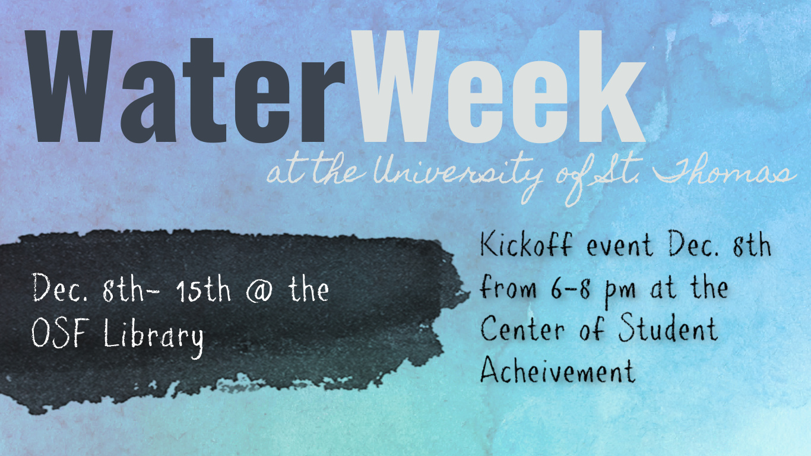

#### University of St. Thomas presents...

# Water Week: Flowing Through St. Thomas INDEX PAGE

> *Mni Wiconi - Water is Life*

### What is Water Week?
From December 8 to December 15, the University of St. Thomas will celebrate water and explore what water is to us. Water has many different meanings to many people, but one universal idea stands out from the rest: "Water is Life." Water is constantly around us, and we use it in our everyday lives. From the food we eat to the clothes we wear, water is essential. 

These are not correctly linked yet!

## The History of Water On Campus
[History of Water](https://alina-kan.github.io/water-week/history/)

## Water Justice in Minnesota
[Water Justice](https://alina-kan.github.io/water-week/water-justice/)

## University of St.Thomas First Sustainability Strategic Plan
[Sustainability](https://alina-kan.github.io/water-week/sustainability/)

## How Water is Involved with Catholic Social Teaching
[Catholic Social Teaching](https://alina-kan.github.io/water-week/teaching/)

## What You Can Do To Help:
[Resources and Petitions](https://alina-kan.github.io/water-week/resources/)

## Video: Water Traveling from UST to the Gulf of Mexico

<iframe width="800" height="450" src="https://www.youtube.com/embed/F_JCGDkMq-c" title="YouTube video player" frameborder="0" allow="accelerometer; autoplay; clipboard-write; encrypted-media; gyroscope; picture-in-picture" allowfullscreen></iframe>

