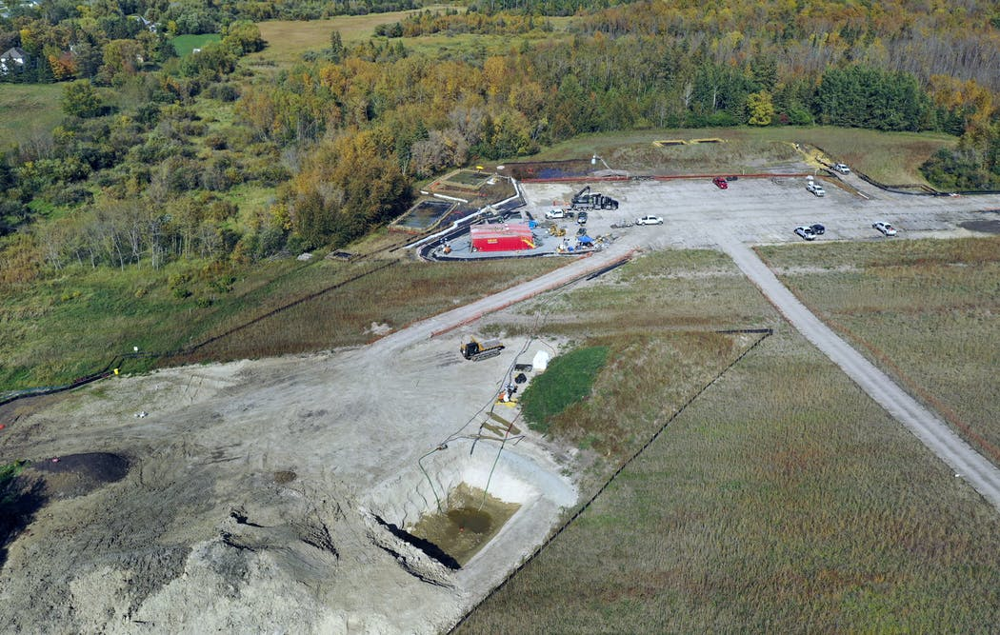

--- 
layout: page
title: "Water Justice in Minnesota"
permalink: /water-justice/
--- 

## Water Justice in Minnesota
### Line 3
As part of the Minnesotan community, we should all know by now the pride that Minnesota takes in the lakes that call our state home. Because of this, it’s important to recognize the very real threats that our precious freshwater sources face here at home in Minnesota. One of the biggest threats is the construction of oil pipelines, particularly the construction of the Line 3 oil pipeline that stretches from Alberta, Canada, to Superior, Wisconsin, running through the treaty territories and wetlands of the Anishinaabe peoples. Pipelines break -- there’s no way of evading that inevitable future. In order to protect and respect our treaties, our freshwater resources, and the future of the wellbeing of our state, it’s utterly important that we reject the construction and usage of pipelines now and in the future. Please, to read more information and see what you can do to combat this issue, visit the Stop Line 3 website to learn more from our local organizers:

[Stop Line 3](https://www.stopline3.org/#intro)

### Enbridge and the Bleeding Aquifer
Despite the efforts of many local organizers to stop the creation and use of the Line 3 oil pipeline, the approval of the project went through, ultimately causing oil to start flowing through the lines in early October. Though there are major environmental and health concerns associated with the current use of the pipeline, the first detrimental effects were felt before the pipeline was even in use -- during its construction. Months ago, Enbridge, a natural gas distribution company that is in charge of constructing Line 3, dug too deep into the ground during the construction of the pipeline, piercing an aquifer. After five months of inaction on the leaking aquifer, the end result was a 24 million gallon groundwater leak. Critics note that Endbridge’s actions are not only a violation of state law, but also of public trust. As a result, Minnesota regulators and the Minnesota DNR have ordered Endbridge to pay $3 million for its violation of state environmental law and the resulting damages. 

